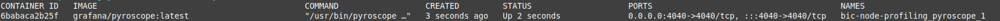
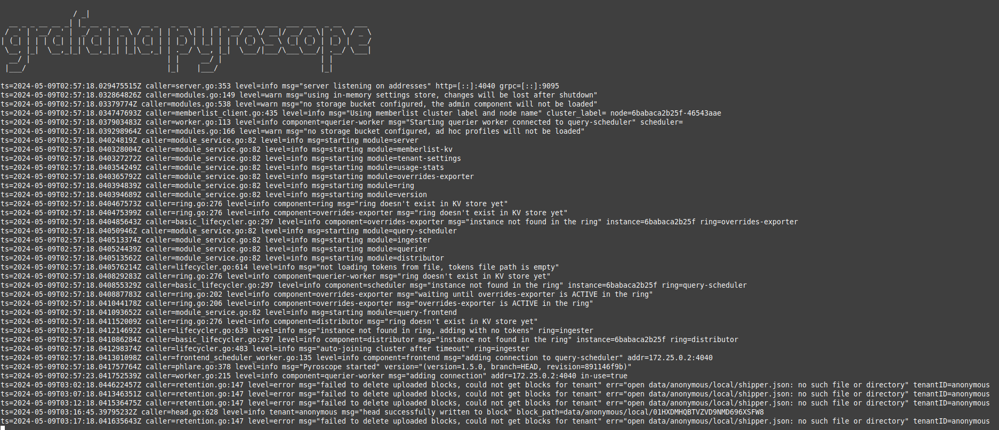

## Getting started

  ```
  npm install @beincom/node-profile
  # yarn add @beincom/node-profile
  ```

### Usage

  ```
    # app.module.ts
    @Module({
      imports: [
        ProfileModule.forRootAsync({
          useFactory: (configService: ConfigService) => {
            const labels: Record<string, string | number> = {
              pod: process.env.pod,
              version: process.env.version,
            };

            const tags: Record<string, string> = {};

            const profileConfig: ProfileConfig = {
              serverAddress: pyroscope.serverAddress,
              applicationName: process.env.APP_NAME,
              tags: tags,
              heap: {
                samplingIntervalBytes: Number(process.env.HEAP_INTERVAL_BYTES), // 512 * 1024
                stackDepth: Number(process.env.HEAD_STACK_DEPTH), // Maximum is 64
              },
              wall: {
                samplingDurationMs: Number(process.env.WALL_DURATION), // 10 * 1000
                samplingIntervalMicros: Number(process.env.WALL_INTERVAL), // 10 * 1000 * 1000
              },
            };

            const profileService = new ProfileService(profileConfig);
            profileService.setWallLabels(labels);
            profileService.start();
            return profileService;
          },
          inject: [ConfigService],
        }),
      ],
      providers: [],
      exports: [],
    })
    export class AppModule {}
  ```

### Test

  ```
  # pyroscope-config.yaml
  log-level: debug
  storage:
    type: filesystem
    path: /var/lib/pyroscope
  scrape-configs:
    - job-name: testing            # any name
      enabled-profiles: [cpu, mem] # cpu and mem for cpu and heap
      static-configs:
        - application: rideshare
          spy-name: nodespy        # make pyroscope know it's node profiles
          targets:
            - localhost:3001       # address of your scrape target
          labels:
            env: dev               # labels
  ```

  ```
  # docker-compose.yaml
  version: '3'

  services:
    pyroscope:
      image: grafana/pyroscope:latest
      ports:
        - "4040:4040"
      environment:
        - PYROSCOPE_SERVER_TYPE=pyroscope
        - PYROSCOPE_STORAGE_TYPE=filesystem
        - PYROSCOPE_LOG_LEVEL=debug
        - PYROSCOPE_LISTEN_ADDR=0.0.0.0:4040
        - PYROSCOPE_STORAGE_PATH=/var/lib/pyroscope
        - PYROSCOPE_MODE=pull
      volumes:
        - pyroscope-data:/var/lib/pyroscope
        - ./pyroscope-config.yaml:/etc/pyroscope/pyroscope-config.yaml

  volumes:
    pyroscope-data:
      driver: local
      driver_opts:
        type: 'none'
        o: 'bind'
        device: './pyroscope-data'
  ```

  ```
  # Run this command:
  docker-compose up -d --force-recreate
  docker ps
  ```

  

  ```
  docker logs -f 6ba
  ```

  